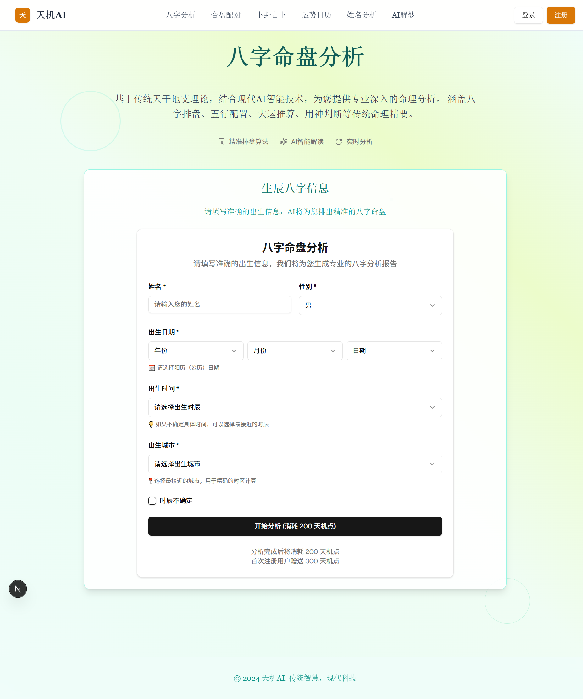
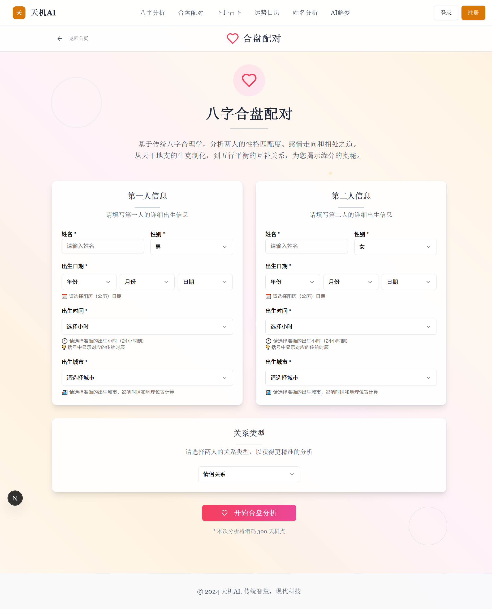
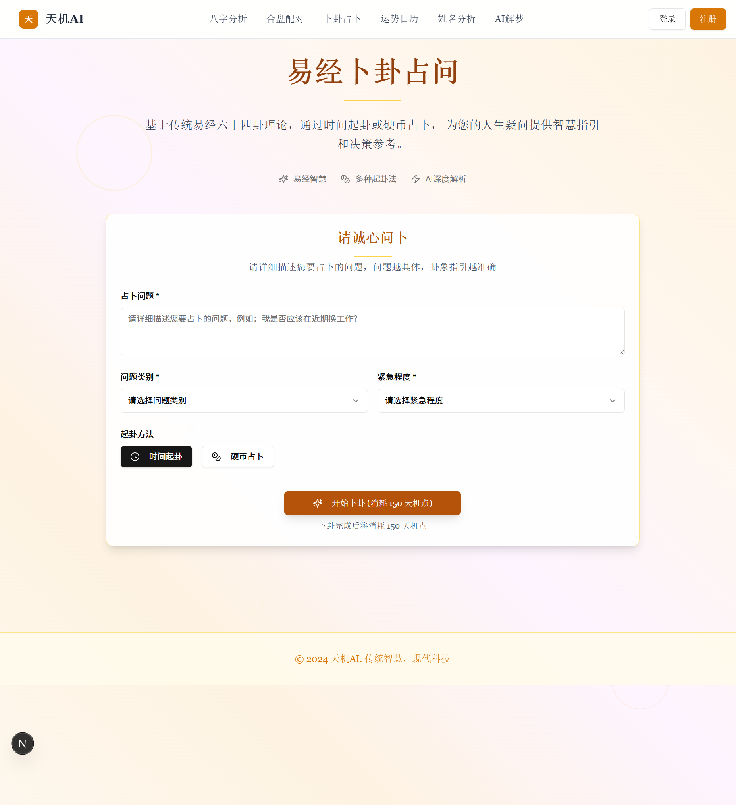
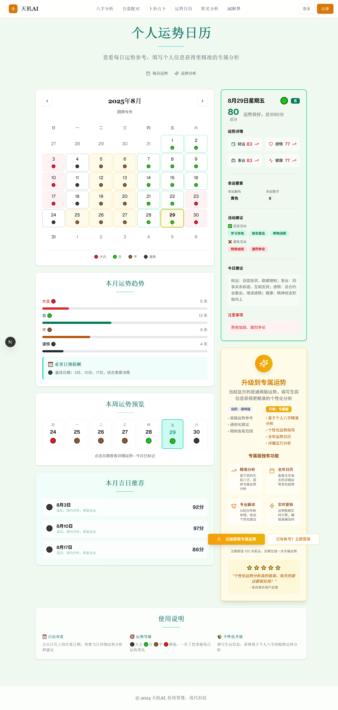
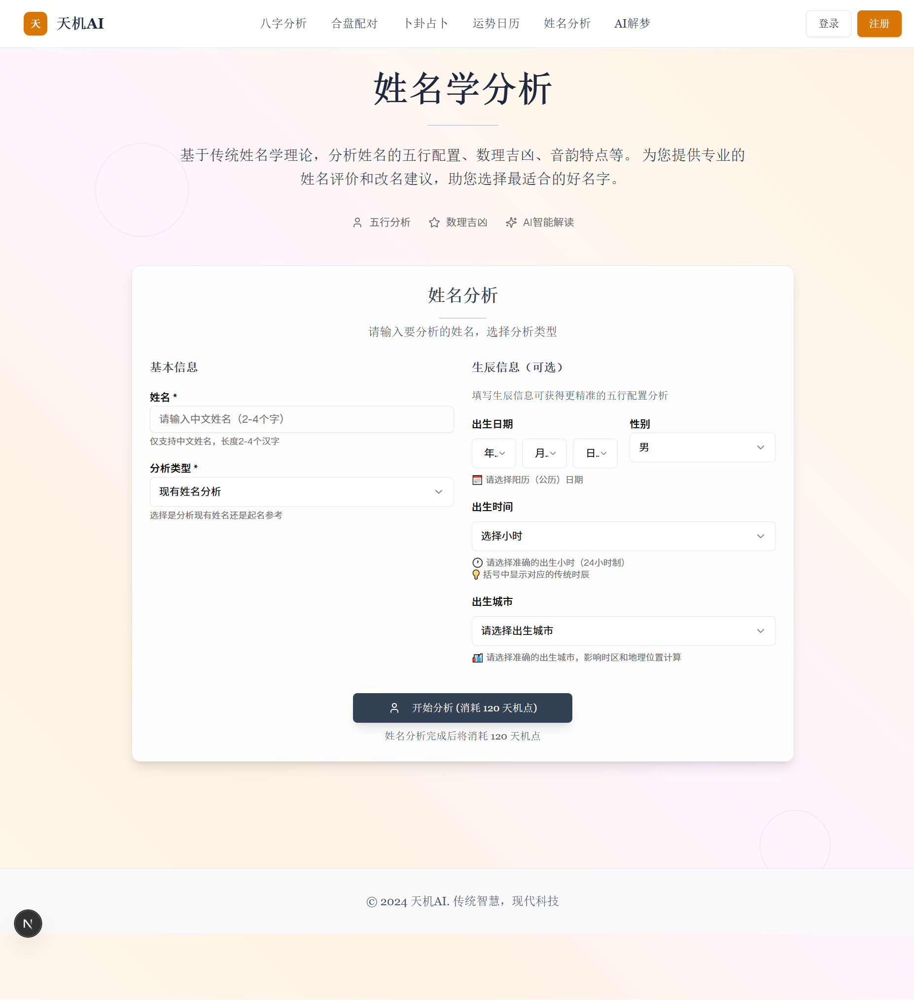
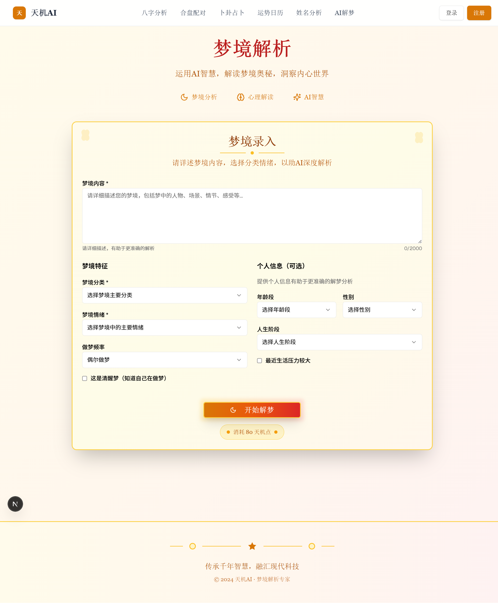

# 天机AI - AI驱动的东方玄学平台

<div align="center">
  
  
  [](https://nextjs.org/)
  [](https://reactjs.org/)
  [](https://www.typescriptlang.org/)
  [](https://supabase.com/)
  [](https://deepseek.com/)
  
  **结合传统东方智慧与现代AI技术的个性化命理分析平台**
</div>

## 📖 项目简介

天机AI是一个创新的AI驱动东方玄学平台，将传统中华命理学与现代人工智能技术完美融合。平台提供专业的八字命理分析、合盘配对、卜卦占卜、运势预测等多元化服务，旨在为用户提供科学、准确、个性化的命理指导。

### ✨ 核心特色

- 🎯 **AI驱动分析** - 基于DeepSeek大模型，提供智能化命理解读
- 🔮 **多元化服务** - 涵盖八字、合盘、卜卦、运势、姓名、解梦六大核心功能
- 💎 **天机点系统** - 创新的虚拟积分体系，灵活的付费模式
- 🎨 **东方美学设计** - 融合传统文化元素的现代化UI设计
- 📱 **全端响应式** - 完美适配桌面端与移动端体验
- 🌙 **明暗主题** - 支持日夜模式切换，护眼舒适

## 🎪 功能模块

### 1. 个人八字命盘 (200天机点)
- 根据出生时间生成专业八字命盘
- AI深度解析性格特质、事业运势、感情走向
- 提供人生建议和改运方向



### 2. 八字合盘配对 (300天机点)
- 双人八字深度匹配分析
- 感情兼容性评分和详细解读
- 关系发展建议和注意事项



### 3. 日常卜卦占卜 (150天机点)
- 基于易经六十四卦的智能占卜
- 支持抛硬币等互动式卜卦体验
- 针对具体问题提供指导建议



### 4. 个人运势日历 (100天机点)
- 基于八字的每日运势预测
- 吉凶宜忌、幸运色彩、数字推荐
- 个性化的日常生活指导



### 5. 姓名学分析 (120天机点)
- 专业的姓名学五格剖象分析
- 姓名与八字的匹配度评估
- 改名建议和吉祥用字推荐



### 6. AI智能解梦 (80天机点)
- AI驱动的梦境象征解析
- 结合心理学与传统解梦理论
- 梦境寓意和生活指导建议



## 🛠️ 技术栈

### 前端技术
- **框架**: Next.js 15+ (App Router)
- **UI库**: React 19 + TypeScript
- **样式**: Tailwind CSS + shadcn/ui组件
- **状态管理**: Zustand
- **表单处理**: React Hook Form + Zod
- **主题**: next-themes (明暗模式)
- **图标**: Lucide React

### 后端技术
- **数据库**: Supabase (PostgreSQL)
- **认证**: Supabase Auth (Cookie-based SSR)
- **实时功能**: Supabase Realtime
- **安全**: Row Level Security (RLS)

### AI集成
- **AI服务**: DeepSeek API
- **接口**: OpenAI SDK兼容
- **模型**: deepseek-chat

### 测试框架
- **单元测试**: Jest + React Testing Library
- **集成测试**: Jest
- **E2E测试**: Playwright
- **API模拟**: MSW

## 🚀 快速开始

### 环境要求
- Node.js 18+
- npm 或 yarn
- Git

### 安装步骤

1. **克隆项目**
```bash
git clone https://github.com/your-username/tianji-ai.git
cd tianji-ai
```

2. **安装依赖**
```bash
npm install
```

3. **环境配置**
```bash
# 复制环境变量模板
cp .env.local.example .env.local

# 编辑环境变量
# NEXT_PUBLIC_SUPABASE_URL=your-supabase-url
# NEXT_PUBLIC_SUPABASE_PUBLISHABLE_OR_ANON_KEY=your-supabase-anon-key
# DEEPSEEK_API_KEY=your-deepseek-api-key
```

4. **启动开发服务器**
```bash
npm run dev
```

4. **数据库设置**
```bash
# 登录到 Supabase 项目控制台
# 1. 访问 https://supabase.com/dashboard
# 2. 创建新项目或选择现有项目
# 3. 在 SQL Editor 中执行数据库迁移
```

在 Supabase 项目的 SQL Editor 中执行以下 SQL 脚本来创建所需的数据表：

```sql
-- 创建用户资料表
CREATE TABLE public.user_profiles (
  id UUID REFERENCES auth.users ON DELETE CASCADE PRIMARY KEY,
  full_name TEXT,
  avatar_url TEXT,
  created_at TIMESTAMP WITH TIME ZONE DEFAULT timezone('utc'::text, now()) NOT NULL,
  updated_at TIMESTAMP WITH TIME ZONE DEFAULT timezone('utc'::text, now()) NOT NULL
);

-- 创建天机点账户表
CREATE TABLE public.tianji_accounts (
  id UUID REFERENCES auth.users ON DELETE CASCADE PRIMARY KEY,
  balance INTEGER DEFAULT 100 NOT NULL CHECK (balance >= 0),
  total_earned INTEGER DEFAULT 100 NOT NULL,
  total_spent INTEGER DEFAULT 0 NOT NULL,
  created_at TIMESTAMP WITH TIME ZONE DEFAULT timezone('utc'::text, now()) NOT NULL,
  updated_at TIMESTAMP WITH TIME ZONE DEFAULT timezone('utc'::text, now()) NOT NULL
);

-- 创建天机点交易记录表
CREATE TABLE public.tianji_transactions (
  id UUID DEFAULT gen_random_uuid() PRIMARY KEY,
  user_id UUID REFERENCES auth.users ON DELETE CASCADE NOT NULL,
  type TEXT NOT NULL CHECK (type IN ('earn', 'spend', 'refund')),
  amount INTEGER NOT NULL,
  description TEXT,
  related_service TEXT,
  related_id UUID,
  created_at TIMESTAMP WITH TIME ZONE DEFAULT timezone('utc'::text, now()) NOT NULL
);

-- 创建八字分析记录表
CREATE TABLE public.bazi_analyses (
  id UUID DEFAULT gen_random_uuid() PRIMARY KEY,
  user_id UUID REFERENCES auth.users ON DELETE CASCADE NOT NULL,
  name TEXT NOT NULL,
  gender TEXT NOT NULL CHECK (gender IN ('male', 'female')),
  birth_year INTEGER NOT NULL,
  birth_month INTEGER NOT NULL,
  birth_day INTEGER NOT NULL,
  birth_hour INTEGER NOT NULL,
  birth_city TEXT NOT NULL,
  lunar_date JSONB,
  bazi_chart JSONB NOT NULL,
  analysis_result JSONB NOT NULL,
  created_at TIMESTAMP WITH TIME ZONE DEFAULT timezone('utc'::text, now()) NOT NULL
);

-- 创建合盘分析记录表
CREATE TABLE public.hepan_analyses (
  id UUID DEFAULT gen_random_uuid() PRIMARY KEY,
  user_id UUID REFERENCES auth.users ON DELETE CASCADE NOT NULL,
  person1_info JSONB NOT NULL,
  person2_info JSONB NOT NULL,
  relationship_type TEXT NOT NULL,
  compatibility_score INTEGER NOT NULL CHECK (compatibility_score >= 0 AND compatibility_score <= 100),
  analysis_result JSONB NOT NULL,
  created_at TIMESTAMP WITH TIME ZONE DEFAULT timezone('utc'::text, now()) NOT NULL
);

-- 创建卜卦记录表
CREATE TABLE public.bugua_divinations (
  id UUID DEFAULT gen_random_uuid() PRIMARY KEY,
  user_id UUID REFERENCES auth.users ON DELETE CASCADE NOT NULL,
  question TEXT NOT NULL,
  question_category TEXT NOT NULL,
  urgency_level TEXT NOT NULL,
  divination_method TEXT NOT NULL CHECK (divination_method IN ('time', 'coin')),
  hexagram_data JSONB NOT NULL,
  interpretation JSONB NOT NULL,
  created_at TIMESTAMP WITH TIME ZONE DEFAULT timezone('utc'::text, now()) NOT NULL
);

-- 创建运势记录表
CREATE TABLE public.calendar_fortunes (
  id UUID DEFAULT gen_random_uuid() PRIMARY KEY,
  user_id UUID REFERENCES auth.users ON DELETE CASCADE NOT NULL,
  fortune_date DATE NOT NULL,
  user_info JSONB NOT NULL,
  fortune_data JSONB NOT NULL,
  created_at TIMESTAMP WITH TIME ZONE DEFAULT timezone('utc'::text, now()) NOT NULL,
  UNIQUE(user_id, fortune_date)
);

-- 创建姓名分析记录表
CREATE TABLE public.name_analyses (
  id UUID DEFAULT gen_random_uuid() PRIMARY KEY,
  user_id UUID REFERENCES auth.users ON DELETE CASCADE NOT NULL,
  name TEXT NOT NULL,
  analysis_type TEXT NOT NULL CHECK (analysis_type IN ('existing', 'suggestion')),
  birth_info JSONB,
  analysis_result JSONB NOT NULL,
  created_at TIMESTAMP WITH TIME ZONE DEFAULT timezone('utc'::text, now()) NOT NULL
);

-- 创建解梦记录表
CREATE TABLE public.dream_interpretations (
  id UUID DEFAULT gen_random_uuid() PRIMARY KEY,
  user_id UUID REFERENCES auth.users ON DELETE CASCADE NOT NULL,
  dream_content TEXT NOT NULL,
  dream_category TEXT NOT NULL,
  dream_emotion TEXT NOT NULL,
  dream_frequency TEXT,
  is_lucid_dream BOOLEAN DEFAULT FALSE,
  user_demographics JSONB,
  interpretation JSONB NOT NULL,
  created_at TIMESTAMP WITH TIME ZONE DEFAULT timezone('utc'::text, now()) NOT NULL
);

-- 创建用户收藏表
CREATE TABLE public.user_favorites (
  id UUID DEFAULT gen_random_uuid() PRIMARY KEY,
  user_id UUID REFERENCES auth.users ON DELETE CASCADE NOT NULL,
  item_type TEXT NOT NULL,
  item_id UUID NOT NULL,
  created_at TIMESTAMP WITH TIME ZONE DEFAULT timezone('utc'::text, now()) NOT NULL,
  UNIQUE(user_id, item_type, item_id)
);

-- 启用行级安全策略 (RLS)
ALTER TABLE public.user_profiles ENABLE ROW LEVEL SECURITY;
ALTER TABLE public.tianji_accounts ENABLE ROW LEVEL SECURITY;
ALTER TABLE public.tianji_transactions ENABLE ROW LEVEL SECURITY;
ALTER TABLE public.bazi_analyses ENABLE ROW LEVEL SECURITY;
ALTER TABLE public.hepan_analyses ENABLE ROW LEVEL SECURITY;
ALTER TABLE public.bugua_divinations ENABLE ROW LEVEL SECURITY;
ALTER TABLE public.calendar_fortunes ENABLE ROW LEVEL SECURITY;
ALTER TABLE public.name_analyses ENABLE ROW LEVEL SECURITY;
ALTER TABLE public.dream_interpretations ENABLE ROW LEVEL SECURITY;
ALTER TABLE public.user_favorites ENABLE ROW LEVEL SECURITY;

-- 创建 RLS 政策
CREATE POLICY "用户只能查看自己的资料" ON public.user_profiles FOR ALL USING (auth.uid() = id);
CREATE POLICY "用户只能操作自己的天机点账户" ON public.tianji_accounts FOR ALL USING (auth.uid() = id);
CREATE POLICY "用户只能查看自己的交易记录" ON public.tianji_transactions FOR ALL USING (auth.uid() = user_id);
CREATE POLICY "用户只能查看自己的八字分析" ON public.bazi_analyses FOR ALL USING (auth.uid() = user_id);
CREATE POLICY "用户只能查看自己的合盘分析" ON public.hepan_analyses FOR ALL USING (auth.uid() = user_id);
CREATE POLICY "用户只能查看自己的卜卦记录" ON public.bugua_divinations FOR ALL USING (auth.uid() = user_id);
CREATE POLICY "用户只能查看自己的运势记录" ON public.calendar_fortunes FOR ALL USING (auth.uid() = user_id);
CREATE POLICY "用户只能查看自己的姓名分析" ON public.name_analyses FOR ALL USING (auth.uid() = user_id);
CREATE POLICY "用户只能查看自己的解梦记录" ON public.dream_interpretations FOR ALL USING (auth.uid() = user_id);
CREATE POLICY "用户只能管理自己的收藏" ON public.user_favorites FOR ALL USING (auth.uid() = user_id);

-- 创建天机点操作函数
CREATE OR REPLACE FUNCTION public.spend_tianji_points(
  p_user_id UUID,
  p_amount INTEGER,
  p_description TEXT,
  p_service TEXT DEFAULT NULL,
  p_related_id UUID DEFAULT NULL
)
RETURNS BOOLEAN
LANGUAGE plpgsql
SECURITY DEFINER
AS $$
DECLARE
  current_balance INTEGER;
BEGIN
  -- 检查用户余额
  SELECT balance INTO current_balance
  FROM public.tianji_accounts
  WHERE id = p_user_id;
  
  IF current_balance IS NULL THEN
    RETURN FALSE;
  END IF;
  
  IF current_balance < p_amount THEN
    RETURN FALSE;
  END IF;
  
  -- 更新账户余额
  UPDATE public.tianji_accounts
  SET 
    balance = balance - p_amount,
    total_spent = total_spent + p_amount,
    updated_at = now()
  WHERE id = p_user_id;
  
  -- 记录交易
  INSERT INTO public.tianji_transactions (
    user_id, type, amount, description, related_service, related_id
  ) VALUES (
    p_user_id, 'spend', p_amount, p_description, p_service, p_related_id
  );
  
  RETURN TRUE;
END;
$$;

-- 创建新用户时自动创建相关记录的函数
CREATE OR REPLACE FUNCTION public.handle_new_user()
RETURNS TRIGGER
LANGUAGE plpgsql
SECURITY DEFINER
AS $$
BEGIN
  -- 创建用户资料
  INSERT INTO public.user_profiles (id, full_name)
  VALUES (
    new.id,
    COALESCE(new.raw_user_meta_data->>'full_name', split_part(new.email, '@', 1))
  );
  
  -- 创建天机点账户（新用户赠送100点）
  INSERT INTO public.tianji_accounts (id, balance, total_earned)
  VALUES (new.id, 100, 100);
  
  -- 记录赠送交易
  INSERT INTO public.tianji_transactions (user_id, type, amount, description)
  VALUES (new.id, 'earn', 100, '新用户注册赠送');
  
  RETURN new;
END;
$$;

-- 创建触发器：新用户注册时自动执行
CREATE TRIGGER on_auth_user_created
  AFTER INSERT ON auth.users
  FOR EACH ROW EXECUTE FUNCTION public.handle_new_user();
```

5. **启动开发服务器**
```bash
npm run dev
```

6. **访问应用**
打开浏览器访问 `http://localhost:3000`

## 📋 可用命令

```bash
# 开发
npm run dev          # 启动开发服务器
npm run build        # 构建生产版本
npm start           # 启动生产服务器

# 代码质量
npm run lint         # 代码检查
npm run type-check   # 类型检查

# 测试
npm run test         # 单元测试
npm run test:watch   # 监听模式测试
npm run test:coverage # 测试覆盖率
npm run test:integration # 集成测试
npm run test:e2e     # E2E测试
npm run test:all     # 运行所有测试
```

## 🗄️ 数据库部署

### Supabase 数据库设置步骤

1. **创建 Supabase 项目**
   - 访问 [Supabase Dashboard](https://supabase.com/dashboard)
   - 点击 "New project" 创建新项目
   - 选择组织，填写项目名称和数据库密码
   - 选择地区（建议选择离用户最近的地区）

2. **获取项目配置**
   - 项目创建完成后，进入项目设置
   - 在 "Settings" → "API" 中找到：
     - `Project URL` (用于 `NEXT_PUBLIC_SUPABASE_URL`)
     - `anon public` key (用于 `NEXT_PUBLIC_SUPABASE_PUBLISHABLE_OR_ANON_KEY`)

3. **执行数据库迁移**
   - 在项目控制台中进入 "SQL Editor"
   - 创建一个新查询，复制上述完整的 SQL 脚本
   - 点击 "Run" 执行脚本，创建所有数据表和安全策略

4. **验证数据库设置**
   ```sql
   -- 验证表是否创建成功
   SELECT table_name 
   FROM information_schema.tables 
   WHERE table_schema = 'public';
   
   -- 检查 RLS 策略是否启用
   SELECT tablename, rowsecurity 
   FROM pg_tables 
   WHERE schemaname = 'public';
   ```

5. **测试新用户注册**
   - 启动应用后注册一个新用户
   - 检查 `user_profiles` 和 `tianji_accounts` 表是否自动创建了记录
   - 验证新用户是否获得了 100 天机点的初始余额

### 数据库表结构说明

| 表名 | 用途 | 关键字段 |
|------|------|----------|
| `user_profiles` | 用户基础信息 | `id`, `full_name`, `avatar_url` |
| `tianji_accounts` | 天机点账户 | `balance`, `total_earned`, `total_spent` |
| `tianji_transactions` | 天机点交易记录 | `type`, `amount`, `description` |
| `bazi_analyses` | 八字分析记录 | `bazi_chart`, `analysis_result` |
| `hepan_analyses` | 合盘分析记录 | `compatibility_score`, `analysis_result` |
| `bugua_divinations` | 卜卦记录 | `question`, `hexagram_data`, `interpretation` |
| `calendar_fortunes` | 运势记录 | `fortune_date`, `fortune_data` |
| `name_analyses` | 姓名分析记录 | `name`, `analysis_type`, `analysis_result` |
| `dream_interpretations` | 解梦记录 | `dream_content`, `interpretation` |
| `user_favorites` | 用户收藏 | `item_type`, `item_id` |

### 安全特性

- **行级安全 (RLS)**: 每个表都启用了 RLS，确保用户只能访问自己的数据
- **数据库函数**: `spend_tianji_points()` 函数处理天机点消费的原子性操作
- **自动触发器**: 新用户注册时自动创建相关记录和赠送初始天机点
- **外键约束**: 确保数据完整性和一致性

## 📁 项目结构

```
tianji/
├── app/                    # Next.js App Router
│   ├── (auth)/            # 认证相关页面
│   ├── protected/         # 受保护的页面
│   ├── api/              # API路由
│   └── globals.css       # 全局样式
├── components/            # React组件
│   ├── ui/               # shadcn/ui组件
│   ├── modules/          # 功能模块组件
│   └── navbar.tsx        # 导航栏
├── lib/                  # 工具库
│   ├── supabase/         # Supabase客户端
│   ├── database/         # 数据库服务
│   └── types/            # TypeScript类型
├── docs/                 # 文档和截图
└── public/               # 静态资源
```

## 🎯 商业模式

### 天机点系统
- **兑换比例**: 1元 = 10天机点
- **新用户福利**: 注册赠送100天机点
- **服务定价**:
  - 个人八字命盘: 200点
  - 八字合盘配对: 300点
  - 日常卜卦占卜: 150点
  - 个人运势日历: 100点
  - 姓名学分析: 120点
  - AI智能解梦: 80点

## 🤝 贡献指南

我们欢迎各种形式的贡献！请阅读 [CONTRIBUTING.md](CONTRIBUTING.md) 了解详细信息。

### 开发流程
1. Fork 本仓库
2. 创建功能分支 (`git checkout -b feature/amazing-feature`)
3. 提交更改 (`git commit -m 'Add some amazing feature'`)
4. 推送到分支 (`git push origin feature/amazing-feature`)
5. 创建 Pull Request

## 📄 许可证

本项目采用 MIT 许可证。查看 [LICENSE](LICENSE) 文件了解详情。

## 📞 联系我们

- **项目主页**: https://github.com/your-username/tianji-ai
- **问题反馈**: https://github.com/your-username/tianji-ai/issues
- **邮箱**: contact@tianji-ai.com

## 🙏 致谢

- [Next.js](https://nextjs.org/) - React全栈框架
- [Supabase](https://supabase.com/) - 开源后端服务
- [DeepSeek](https://deepseek.com/) - AI大模型服务
- [shadcn/ui](https://ui.shadcn.com/) - 现代UI组件库
- [Tailwind CSS](https://tailwindcss.com/) - 原子化CSS框架

---

<div align="center">
  Made with ❤️ by the 天机AI Team
</div>
